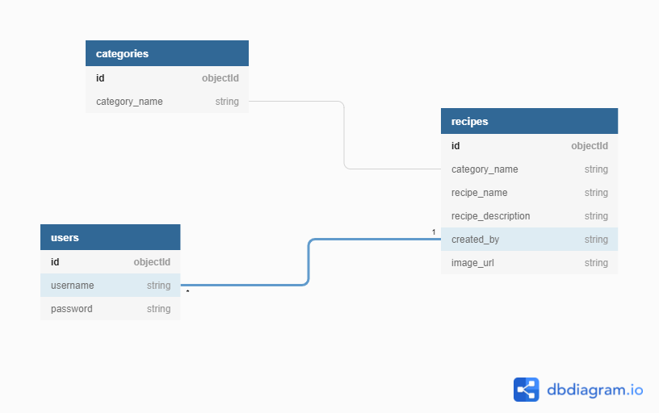

## **Content**

- [**UX (User Experience)**](#ux-user-experience)
  - [**Target Audience**](#target-audience)
  - [**Project Goals**](#project-goals)
  - [**User Stories**](#user-stories)
  
- [**Design Choices**](#design-choices)
  - [**Fonts**](#fonts)
  - [**Colours**](#colours)
  - [**Imagery**](#imagery)
  - [**Wireframes**](#wireframes)
  - [**Logo**](#logo)
  - [**Database**](#database)

- [**Technologies**](#technologies)
  - [**Languages**](#languages)
  - [**Libraries**](#libraries)
  - [**Tools**](#tools)

- [**Features**](#features)
  
- [**Testing**](#testing)
  - [**Functionality Testing**](#functionality-testing)
  - [**User Story Testing**](#user-story-testing)
  - [**Performance Testing**](#performance-testing)
  - [**Responsive**](#responsive)
  - [**W3C Validator**](#w3c-validator)

- [**Bugs**](#bugs)

- [**Deployment**](#deployment)
  - [**Running Locally**](#running-locally)

- [**Credits**](#credits)
  - [**Code**](#code)
  - [**Content**](#content)
  - [**Images**](#images)
  - [**Videos**](#videos)
  - [**Inspiration**](#inspiration)
  - [**Acknowledgements**](#acknowledgements)
  
  ## **UX (User Experience)**

  [Back to contents](#content)

### **Target Audience**

- Familys
- Healthy Individuals

[Back to contents](#content)

### **Project Goals**

The site is aimed at people who would like to add their own recipes and also people who just want to have a browse at other peoples.

As a site owner, I would like to provide a clear, easy to navigate, eye catching site that users will enjoy visiting and find everything they are looking for. I want to give access to recipes for users to read and maybe give it a go at creating some for themselves. I would also want the user to gain access to recipes that have already been added without creating an account. By achieving this, the users would be encourages to engage with he website and add their own recipes to the database. They would achieve this be creating a private, secure account so they can upload their own recipes and gain control over content they have added by giving them the ability to update and delete any recipes they have added.


[Back to contents](#content)

### **User Stories**

- As a user, I want to easily add my own recipes with a description of what this recipe includes.
- As a user, I want to be able to navigate through the site easily and read recipes to help me decided which ones I would like to make.
- As a user, I would like to see all the recipes information without having to create an account, so I can decided if I would like to proceed with adding my own recipes.
- As a user, I would like to create a profile so that I can add my own recipes to share with others.
- As a user, I would like to search the database for a specific ingredient or recipe.
- As a user, I would like to edit or delete a recipe so that changes can be made.
- As a user, I would like to see social media links so that I can keep up to date on any changes made.

[Back to contents](#content)

## **Design Choices**

### **Fonts**

When choosing a font I came across a number of really good fonts to chose from on google font and also dafont just to see if they had anything that google font did not. After some testing which a variety of fonts I decided to go with …………… as this was the most eye catching and easier to read and understand. I also went with san-serif as the backup font just in case my chosen font failed.

### **Colours**

I used coolors.co to generate a colour scheme for my project. At first I was going to use black, red and white as these where mutual colours, but after scrolling through the different colour schemes, I decided to go with rich black, blue Munsell and bone as this was a better fir for my website.

### **Imagery**

The main background image for my site will be used throughout all the pages. This was carefully selected to provide eye catching site without distracting from the content on each page.  The image used fits in with the colour scheme I have chosen and allows the content the be the focus of the page. I will also add a black image overlapping the background image and change the opacity on this so that the content on the page will stand out more.

With the images attached to the recipes, I will be allowing the user to upload a link to a image which will add to the visual appeal and will make for a better user experience. I decided to make this an optional part of the add recipe section and if the user prefers to not add a image then a default image will be added in its place.


### **Wireframes**

 ##### **Home Page**
   - Web - [view]()
   - Ipad - [view]()
   - Iphone - [view]()

### **Logo**

### **Database**

I used mongodb as the database for this project, as a non relational, document database, it gives more flexibility to this type of site. I used dbdiagram.io when designing the database schema that would best facilitate this project. I based my schema on using 3 collections – ‘user’, ‘categories’ and ‘recipes’.



[Back to contents](#content)

## **Technologies**

### **Languages**
  - [HTML5](https://en.wikipedia.org/wiki/HTML5). 
    - Used for the main markup language for my game content.
  - [CSS3](https://en.wikipedia.org/wiki/CSS). 
    - Used to style my pages and the content on the game.
  - [JS](https://en.wikipedia.org/wiki/JavaScript). 
    - Used to contact the DOM.
  - [Python3](link)
    - Used to ........

 ### **Libraries**
  - Jinja Template engine for Python
  - Flask Python Web Framework
  - Heroku Cloud platform
  - MongoDB Document Oriented Database program
  - jQuery JavaScript Library
  - Materialize CSS Front end Framework
  - Flask-PyMongo Extension to bridge Flask with MongoDB
  - Werkzeug WSGI web application library - used for password security
  - Google Fonts Font library
  - Font awesome Icons
  - Balsamiq Wireframe software
  - dbdiagram.io Database diagram design software
  - coolers.co Color scheme generator
  - Randomkeygen.com Secure password/secret key generator
  - Website Mockup Generator used to generate responsive screenshot
  
 ### **Tools**

  - [Git:](https://git-scm.com/)
    - Git was used for version control by utilizing the Gitpod terminal to commit to Git and Push to GitHub.
  - [GitHub:](https://github.com/) 
    - GitHub is used to store the projects code after being pushed from Git.
  - Photoshop - Used to edit all my images in my project.

[Back to contents](#content)

## **Features**

1. Across the site: 
    - Navigation bar with name (linked back to home page), links to home page, register and log in. These links are visible to the casual user that have not yet created an account. Once a user has registered/logged in, the links change from Register & Log in options, to My profile, Add recipe and Log out. 
    - Footer with links to social media (this will open a new tab to the main homepages of each social media platform as this website is only created for the Code Institute Milestone 3 project and so does not have live social media pages) & link to our contact page. 
    - Use of Flash messages to update the user when an action has been taken.
    - Fully responsive to ensure a good user experience on all devices. 
    
2. Home Pages
    - The home page will dispaly all the recipes that different users have added.
    - All recipes will be added to a card which will dispaly an image and the infomation that the user has given.
    - There will be a button on the card that will also bring up the description of the recipe and also what ingredients are used.
    - Below the card will be an edit and delete button so that if a mistake was made they can correct this.

3. Add Recipe Page   
    - For registered and logged in users, this page allows them to create their own recipe. The form shows a clear understanding of what needs to be done and if the input fields are empty then a red outline will show, confirming that the user needs to fill out the input field. Once filled out the box will then turn screen to confirm that infomation has been added. 
    - When the user submits the recipe, the user will be redireted back to the recipe page which they can view their added recipe. 
    - The user will be able to add thier own image to the recipe if they choose to, but if they choose not to a defualt image will be provided for them.

4. Profile Page
    - For registered and logged in users, this page shows any recipes they have created and submitted to the site. The recipes show edit and delete buttons so the user can perform these actions as they wish and will be redirected to the edit recipe page or a confirm delete warining will show up just in case the user mistakenly clicked the button.
    - If no recipes have been added by the user, a message will display to prompt the user in creating a recipe. 

5. Edit Recipe 
    - Form is consistent with the Add Recipe form to ensure ease of use for the user, it is prefilled with all the details that were orgianlly used to add the recipe.

6. Register Page/ Log In Page
    - The same format was used across these pages with a form on each, containing clear infomation on what to fill in.
    - Once the user has registered or logged in successfully, they will be redirected to their profile page. 

[Back to contents](#content)

## **Testing**

[Back to contents](#content)

## **Bugs**

[Back to contents](#content)

## **Deployment**

### **Github**
   - The project was deployed to GitHub Pages as follows:
       1. Log in to GitHub and locate the [GitHub Repository](https://lukesmallman.github.io/pure-fitness/)
       2. Locate the "Settings" button in the menu above the Repository.
          - Alternatively, click [here](https://docs.github.com/en/pages/getting-started-with-github-pages/creating-a-github-pages-site) from the "Creating your site" section for a description of the process.
       3. Scroll down the Settings page until you locate the "Pages" section.
       4. In the "Source" section, select the dropdown "Branch:" dropdown and select "Main".
       5. The page refreshes automatically.
       6. Scroll to "Your site is published at..." for the puslished site link in the "GitHub Pages" section.

  
  ### **Forking the GitHub Repository**
   - A fork is a copy of the original repository on put account so that you can make changes withough effecting the original one.
      1. Log in to GitHub and locate the [GitHub Repository](https://github.com/ElrieM/CI_MS1_MBM)
      2. In the banner above the Repository, click on the "Fork" button.
      3. If you have succeeded, you now have a copy of the original repository in your GitHub account.

  ### **Making a Local Clone**
   1. Log in to GitHub and locate the [GitHub Repository](https://github.com/ElrieM/CI_MS1_MBM)
   2. Click on Code, click on the copy button next to HTTPS to copy the URL. 
   3. Change the current working directory to the location where the cloned directory should be stored.
   4. Type "git clone', then paste the URL copied in step 2.
   5. Press Enter to create a local clone.

  ### **Heroku Deployment**
1. In the Gitpod environment, within the project, create a .gitignore file and an env.py file. 
2. In the env.py file, `import os` and then set the following environment variables: 
```
os.environ.setdefault("IP", "0.0.0.0")
os.environ.setdefault("PORT", "5000")
os.environ.setdefault("SECRET_KEY", "your unique secret key")
os.environ.setdefault("MONGO_URI", "your unique mongo db link")
os.environ.setdefault("MONGO_DBNAME", "your database name")
```
3. Ensure your env.py file is added to the .gitignore file to ensure this senstive information is not pushed to Github.
4. Create a requirements.txt file which is used to specify what python packages are required to run this project. In the Terminal, type the following command to create this file `pip3 freeze --local > requirements.txt`.
5. Create a Procfile by typing the following in the terminal, `echo web: python app.py > Procfile` making sure to use an uppercase 'P' when naming the file. Open the Procfile and ensure there is no blank line after the first line which should contain `web: python app.py`.
6. Push these files to the project Github Repository.

To deploy to Heroku, the following steps were taken:

1. Go to the [Heroku Website](https://id.heroku.com/login) and log in.
2. In the dashboard, select "Create New App".
3. Choose a unique app name and select the region appropriate to your location and click on 'Create App'.
4. From the dashboard, go to the "Deploy" tab and under "Deployment method" choose Github.
5. Search for your repository name and click on "Connect". 
6. Next, go to the "Settings" tab and scroll down to "Config Vars", click on "Reveal Config Vars".
7. Enter the following keys and values which must match those in your env.py file:

|Key|Value|
|----|----|
|IP|0.0.0.0|
|PORT|5000|
|SECRET_KEY|*your unique secret key*|
|MONGO_URI|*your unique mongo db link*|
|MONGO_DBNAME|*your database name*|

8. Go back to the "Deploy" tab and click on "Enable Automatic Deployment". 
9. Under "Manual Deploy", select "main" and click "Deploy Branch".
10. Once the app has finished building, click on the "Open App" tab at the top right of the page.

[Back to contents](#content)

## **Credits**

[Back to contents](#content)